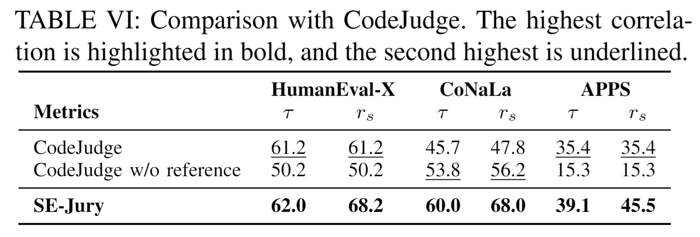

## Comparison between SE-Jury and CodeJudge 

  

As suggested, we compared CodeJudge [1] and our SE-Jury on CodeJudge’s evaluation datasets: HumanEval-X, CoNaLa, and APPS.

As shown in the table above, the results indicate that SE-Jury consistently outperforms CodeJudge, with statistically significant improvements validated by Wilcoxon tests.

Additionally, SE-Jury supports a broader range of tasks, including automated program repair and code summarization, which CodeJudge does not support.

Note that we did not compare with CodeJudge on BigCodeBench due to difficulties in reproducing CodeJudge's data construction process for this dataset, as detailed documentation was lacking. 
Additionally, the authors did not provide output files for this dataset, though they did share outputs for the other datasets (i.e., HumanEval-X, CoNaLa, and APPS). 
Given the limited time during the rebuttal period, we were unable to complete this comparison, but we would be happy to include it in a future major revision if possible.

## Reference

[1] Tong, Weixi, and Tianyi Zhang. "CodeJudge: Evaluating Code Generation with Large Language Models." EMNLP. 2024.

