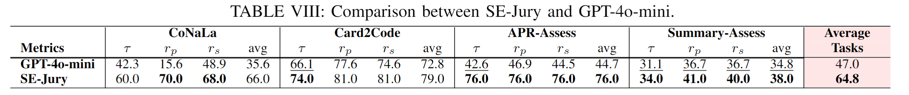

## Comparison between SE-Jury (using GPT-4o-mini) and GPT-4o-mini alone

  

As requested, we compared SE-Jury with its base LLM, GPT-4o-mini, used without any additional design. 
In this setup, GPT-4o-mini received a simple prompt: “Please assign a correctness score to the given input data,” allowing us to assess its raw performance.

As shown in the table above, SE-Jury significantly outperforms the standalone LLM, achieving an average relative improvement of 37.9% across all tasks. This highlights the effectiveness of our method.

