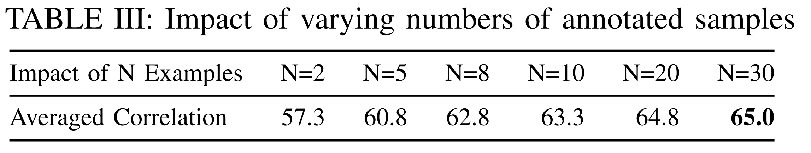

## Impact of Number of Annotated Samples

  

As requested, we assess the impact of varying the number of annotated examples. 

We conducted experiments using different values of N. As shown in the Table above, more annotated samples can improve performance, but also increase the burden on developers in labeling. 

Therefore, we argue that using N = 20 provides a good balance between effectiveness and annotation cost.
