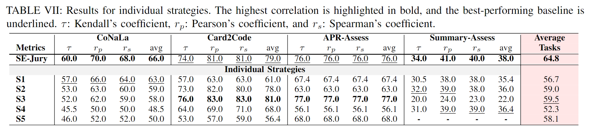

## Performance of Individual Strategies in SE-Jury

  

The table above presents the performance of the five individual strategies (S1, S2, S3, S4, and S5) used in our approach.

The results show that while individual strategies may perform well or poorly on specific datasets, SE-Jury, as a combined team, achieves strong and stable performance across all tasks.

When comparing the average performance across all tasks, SE-Jury outperforms S1, S2, S3, S4, and S5 by 14.3%, 9.8%, 8.9%, 24.0%, and 11.5%, respectively.

This strong overall performance is the result of combining the strengths of the individual strategies; each strategy contributes to at least one of the best-performing teams for different datasets.

Among the individual strategies, S3 performs the best overall, followed by S2 and S5.

Note that S5 is designed to generate test cases for evaluating code correctness, which conflicts with the nature of the code summarization task, where the goal is to assess the quality of summaries. 
In our preliminary experiments, we found that S5 performed poorly on code summarization, so we excluded it from that task.

