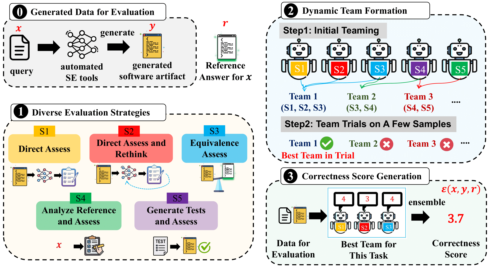

# SE-Jury: An LLM-as-Ensemble-Judge Metric for Narrowing the Gap with Human Evaluation in SE

<div align="center">
  
</div>

## Installation

```bash
git clone https://github.com/AnonymousSubmission2025/LLM_Judge
cd LLM_Judge/

conda create -n se_jury python=3.11
conda activate se_jury
pip install crewai

unzip se_jury.zip
cd se_jury
pip install -e ./
```

## Run Judgement


```bash
cd src/self_evaluation_loop_flow/
```

Before running experiment, please revise the exp.yaml file to choose task and the strategy:
- task: which chooses different task/data. For instance, this filed can be filled as 'hs' (stands for HeartStone Code2Card), 'conala', 'apr', or 'summarization'.
- agent_method: which choose different evaluation strategies. This filed can be filled as: 'direct_assess', 'direct_assess_then_Validate', 'direct_compare', 'analyze_gt_then_validate', and 'test_gene_reason'. These stands for S1, S2, S3, S4, and S5.

Please fill in your OpenAI key in run.sh, as shown below:
```bash
export OPENAI_API_KEY=<Please Fill in Your OpenAI Key here>
```

Then you can run the judgement:

```bash
bash run.sh
```

The result files will be saved in './results/'

## Calculate Evalution Metrics 

```bash
## Corelation
cd eval_scripts/
python hs.py
python conala.py
python apr.py
python summarization.py

## Agreements
cd eval_scripts/agreement_analysis
python hs.py
python conala.py
python apr.py
python summarization.py
```

## Prompts for Each Task

You can access the detailed prompt via `./crews/{Strategy_Name}_crew/config/task_{Data_Name}.yaml`

For instance, the prompt of the `direct-assess` strategy for `HeartStone Code2Code` data is:
`./crews/direct_assess_crew/config/task_hs.yaml`

