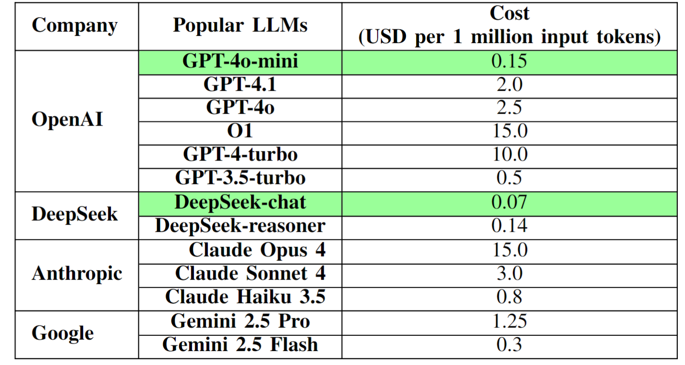
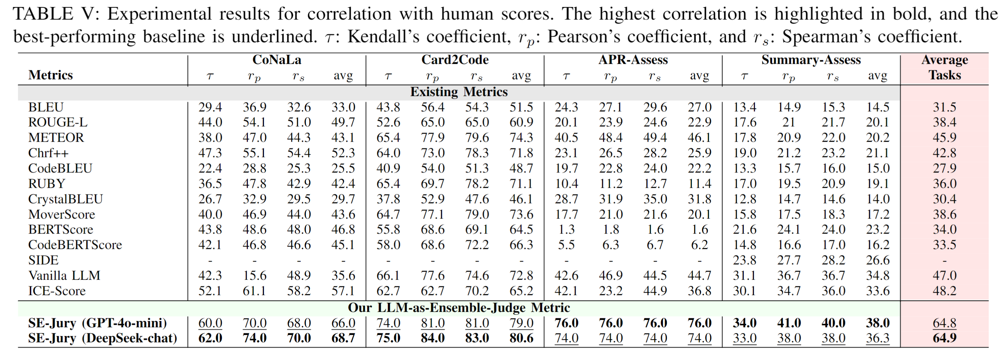

## Our Reason to Choose GPT-4o-mini 

  

 
Since our SE-Jury serves as an evaluator for AI tools (e.g., tools for code generation, automated program repair, and code summarization), we also aim to ensure that our SE-Jury is affordable for users. Therefore, we select LLMs that are state-of-the-art, powerful, and cost-effective.

 
We can see that GPT-4o-mini is significantly more cost-effective than other latest LLMs provided by OpenAI, which is the main reason we chose it. Despite its much lower cost, GPT-4o-mini demonstrates strong coding performance comparable to GPT-4o (87.2% vs. 90.2% Accuracy in HumanEval) [1], making it a highly suitable choice.

## SE-Jury with Another Popular LLM DeepSeek-chat

  

  
In response to the request, we conducted additional experiments using DeepSeek-chat (the corresponding API name is "deepseek/deepseek-chat"), a popular and state-of-the-art LLM that is also highly cost-effective. DeepSeek-Chat is even more affordable than GPT-4o-mini (US$0.07 vs. US$0.15 per million input tokens), as shown in the table at the top of this page.

 
The results show that SE-Jury achieves comparable performance using DeepSeek-chat as the underlying LLM compared to using GPT-4o-mini, demonstrating the method’s consistent effectiveness across state-of-the-art LLMs.

 
Due to time constraints during the rebuttal phase, we only managed to report results with DeepSeek-chat. If allowed a major revision, we would be happy to conduct broader experiments using more LLMs.

## Reference

[1] OpenAI. GPT-4o mini: advancing cost-efficient intelligence. https://openai.com/index/gpt-4o-mini-advancing-cost-efficient-intelligence/
